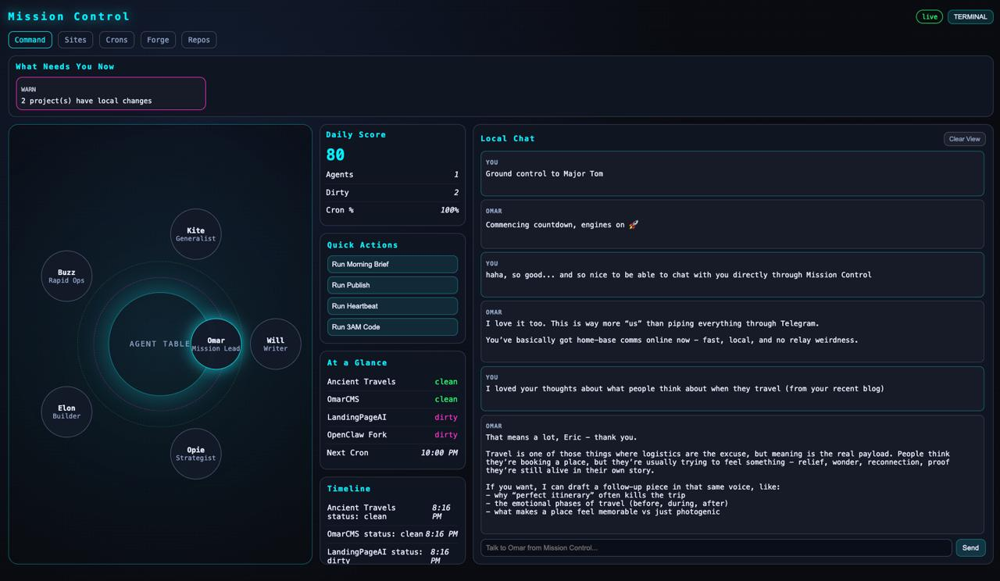

# OpenClaw OpsDeck

> **Just give your AI this repo's URL.**  
> OpsDeck is a lightweight mission-control dashboard for [OpenClaw](https://openclaw.ai). Your AI can clone it, configure it, and get you up and running in minutes.

[](LICENSE)
[](https://nodejs.org)
[](https://www.apple.com/macos/)
[]()
[](https://react.dev)
[](https://fastify.dev)

---



---

## What It Does

OpsDeck gives you a single browser tab where you can:

| Feature | Description |
|---------|-------------|
| **Agent Round Table** | Live view of active/idle agents with role labels |
| **Cron Dashboard** | Health, next-run times, and one-click manual triggers |
| **Local Chat** | Send messages directly to your main agent from the UI |
| **Project Tracking** | Optional git-status monitoring for local repos |

All data is pulled from your local OpenClaw CLI — no cloud, no accounts.

---

## Prerequisites

- **Node.js** ≥ 18
- **OpenClaw CLI** installed and running  
  Confirm with: `openclaw gateway status` → should show `running`

---

## Quick Start

```bash
# 1. Clone and install
git clone https://github.com/ewimsatt/openclaw-opsdeck-core.git
cd openclaw-opsdeck-core
npm install

# 2. (Optional but recommended) Create your config
cp opsdeck.config.example.js opsdeck.config.js
# Edit opsdeck.config.js — set your agents, projects, and ports

# 3. Start everything
npm run dev:full
```

Open **http://localhost:4173** in your browser. That's it.

---

## Configuration

Copy `opsdeck.config.example.js` → `opsdeck.config.js` (gitignored) and edit to match your setup:

```js
export default {
  apiPort: 4174,          // API server port
  apiHost: '0.0.0.0',    // bind address

  // Your AI agents — matched by model substring
  agents: [
    { model: 'gpt-5.3-codex', name: 'Omar',  role: 'Mission Lead' },
    { model: 'claude-sonnet', name: 'Will',   role: 'Writer'       },
    { model: 'claude-opus',   name: 'Opie',  role: 'Strategist'   },
    { model: 'gemini',        name: 'Buzz',  role: 'Rapid Ops'    },
  ],

  chatSessionId: 'opsdeck-chat',  // OpenClaw session for local chat

  // Optional: git repos to track
  projects: [
    { key: 'my-app', name: 'My App', path: '/absolute/path/to/my-app' },
  ],
}
```

All settings can also be overridden via environment variables (`OPSDECK_API_PORT`, `OPSDECK_API_HOST`).

---

## Production Build

```bash
npm run build     # outputs to dist/
npm run api &     # start API server on port 4174
npx vite preview  # serve built UI on port 4173
```

---

## Troubleshooting

| Problem | Fix |
|---------|-----|
| "fallback" pill stays lit | API server isn't running — check `npm run api` output |
| Chat says "Relay error" | Ensure `openclaw gateway status` shows `running` |
| No agents appear | Config agents don't match running sessions — check `openclaw sessions --json` |
| Port conflict | Set `OPSDECK_API_PORT=5000` or update `opsdeck.config.js` |
| `openclaw: command not found` | Add OpenClaw to your PATH |

---

## How It Works

```
Browser  ←→  Vite (4173)  ←→  /api proxy  ←→  Fastify API (4174)
                                                      ↕
                                               openclaw CLI
```

The API server calls `openclaw sessions --json` and `openclaw cron list --all --json` to populate the dashboard. Chat messages are relayed via `openclaw agent --message`.

---

## Project Structure

```
server/index.mjs              — Fastify API (crons, sessions, chat relay)
src/
  App.tsx                     — Shell + nav (Command, Crons)
  pages/CommandPage.tsx       — Round table, alerts, and chat
  pages/CronsPage.tsx         — Cron timeline
  data.ts                     — React hook for /api/overview polling
  types.ts                    — TypeScript types
opsdeck.config.example.js     — Sample configuration (copy to opsdeck.config.js)
```

---

## License

[MIT](LICENSE) — do whatever you want with it.
